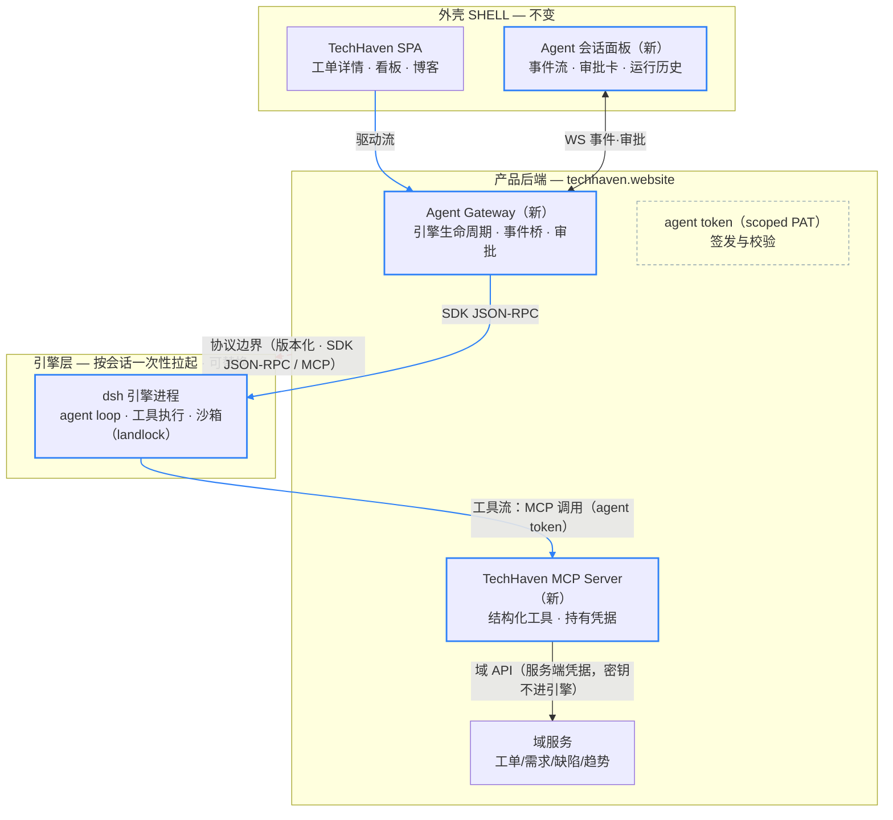
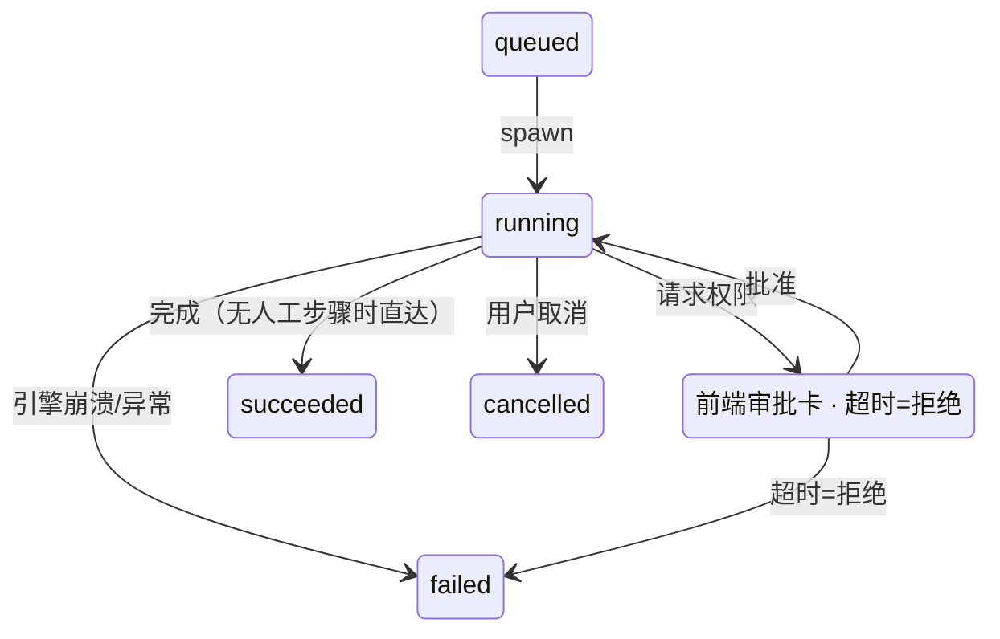

# TH-RFC-001 · TechHaven × DeepSeek Harness 集成架构设计

> **状态** 草案 DRAFT · v0.1 ｜ **日期** 2026-08-29 ｜ **起草** TechHaven 工程组 ｜ **关联** AGENTS.md · dsh v0.1.2-alpha.1

## 摘要

**外壳归 TechHaven · 引擎归 dsh · 协议是边界**

TechHaven 保持产品外壳、品牌与数据主权，将 DeepSeek Harness（dsh）作为**可替换的 agent 引擎进程**，通过版本化协议嵌入。Agent 以结构化工具（MCP）读写研发平台——不操作 UI；用户从工单/看板派发任务并观察执行，结果回写工单与趋势。集成分四个阶段推进，每一步可逆；dsh 全程保持外部依赖身份，不做代码合并、不做进程内装配。

## 01 背景与问题

**TechHaven 现状**：研发 × 博客一体化平台前端（React 19 + TS + Vite，约 4.1 万行，46 个自研组件），后端独立部署于 techhaven.website。已有的可复用基建：内存态 Token 认证（`TokenManager`）、WebSocket 单例 `notificationWS`（登录连/登出断、指数退避重连）、组织切换语义（`RdOrgContext`）、HashID 防`枚举`、AI 摘要 SSE 通道与 `AiConfig`（openai/claude/glm）。

**缺口**：平台拥有"管理面"（需求/缺陷/任务/评审/工单/趋势），没有"执行面"——agent 无法真正修 bug、跑测试、回写结果。这正是 dsh（DeepSeek Harness，Cordis 插件架构的 agent 运行时）的领域。

**dsh 关键事实**（截至 v0.1.2-alpha.1，2026-08 勘察）：

- 官方集成通道三条：`packages/sdk`（TS/Python 客户端以**子进程**方式拉起 `dsh`，JSON-RPC 驱动会话与事件流）、`packages/acp`（Agent Client Protocol，编程式管理会话与**权限应答**）、`packages/mcp/mcp-client`（挂载外部 MCP server，使其工具成为 agent 原生工具）。
- 自身 Web UI 只是 API Gateway（Typert `@Remote`）的一个 client——第三方可以做自己的 client。
- alpha 版本，官方明示 compatibility-breaking changes；MIT 许可。

## 02 目标与非目标

| 编号 | 目标（G）/ 非目标（N） | 说明 |
| --- | --- | --- |
| G1 | 平台内派发与观察 | 用户从工单/缺陷详情一键派发 agent，在 TechHaven 界面内看到执行流与产物。 |
| G2 | 结构化工具读写 | agent 通过 MCP 工具读写研发平台（有权限、可审计），**不**通过点页面操作。 |
| G3 | 结果回流 | agent 的结论、diff、测试结果自动关联回工单/缺陷/趋势数据。 |
| G4 | 外壳主权 | 品牌、交互、数据模型 100% TechHaven；用户全程不感知 dsh 存在。 |
| G5 | 引擎可替换 | 协议即插槽：未来可换其他 agent runtime 而外壳与域服务不动。 |
| N1 | 不做代码合并 | 不 fork、不把 dsh 源码并入仓库（理由见 ADR-02）。 |
| N2 | 不做 UI 自动化 | 不引入 computer-use 式点击操作平台界面（理由见 ADR-04）。 |
| N3 | 首期不做多租户云端执行 | P1 引擎跑在用户本地；容器/E2B 沙箱放到 P2（见 §05.5）。 |
| N4 | 不暴露 dsh Web UI | dsh 自带 Web UI 绑定 `127.0.0.1:3080`，仅限本地调试，不面向终端用户。 |

## 03 决策记录（ADR）

### ADR-01：dsh 以受管引擎进程 + 协议方式嵌入

**结论：采纳**

TechHaven 后端经 `dsh` TypeScript SDK（JSON-RPC）拉起并驱动引擎子进程；前端与域服务完全不改归属。理由：线协议是 dsh 唯一版本化承诺的稳定面；引擎独立进程提供故障隔离、安全爆炸半径收窄与独立伸缩。

### ADR-02：代码合并 / fork dsh 进 TechHaven 仓库

**结论：否决**

dsh 是 8953 文件的 alpha monorepo，官方明示 breaking changes。fork 意味着"合并跑步机 vs 永久分叉"二选一，且维护对象比自身代码库大一个数量级。若确需改内核行为，优先用官方 patches 机制（其仓库自身即用 `patches/`）。

### ADR-03：进程内装配（把 dsh 包 import 进后端进程）

**结论：否决**

绑定 dsh 最不稳定的内部面（Cordis 进程内 API 无兼容承诺）；agent 崩溃即产品进程崩溃；agent 可执行代码，进程内直通产品 token、DB 连接与其他租户数据；dsh 的进程级沙箱（landlock）也要求危险物待在独立进程里。

### ADR-04：Agent 以 UI 自动化方式操作平台

**结论：否决**

拥有 API 的产品不需要 agent 猜 DOM：每次改版即失效、无法细粒度授权、无法审计。一切"agent 操作 TechHaven"的需求一律翻译为 MCP 工具（ADR-05）。

### ADR-05：双向集成：SDK 驱动流 + MCP 工具流

**结论：采纳**

方向 A（TechHaven → agent）：Agent Gateway 经 SDK 开会话、订阅事件。方向 B（agent → TechHaven）：自建 TechHaven MCP Server，把工单/需求/缺陷领域操作暴露为带权限的工具。理由：两条流各自独立演进，均落在版本化协议上。

### ADR-06：渐进路线，预留"插件形态"收敛选项

**结论：采纳**

按 §09 分四阶段推进，每阶段独立可交付、可回退。若未来需要"同运行时"深度融合（Cordis 插件寄宿），仅在 P3 作为**评估项**，不作为承诺。理由：在 alpha 生态上，可逆性优先于深度。

## 04 总体架构

系统分三层：**外壳**（TechHaven SPA，不变）、**产品后端**（域服务 + 两个新增组件）、**引擎层**（dsh 引擎进程，按会话一次性拉起）。层与层之间只有两条数据流：驱动流（人→agent）与工具流（agent→平台）。

*图 1 · 总体架构与两条数据流。蓝色为新增组件（Agent Gateway、TechHaven MCP Server、会话面板、引擎进程）；红色虚线为协议边界——边界之下的一切对产品不可见、可替换。工具流经 MCP Server 而非直连域服务：凭据只在服务端，agent 只持 scoped token。*

## 05 组件设计

### 05.1 Agent Gateway（新 · 后端）

唯一的引擎出入口。职责边界：

| 职责 | 设计要点 |
| --- | --- |
| 引擎生命周期 | 经 dsh SDK 以**命名 profile + 最小 patches**拉起引擎子进程；每会话一次性进程，结束即 `dispose()`；引擎版本与 profile 由 Gateway 统一下发，前端不可指定。 |
| 会话管理 | `open / send / steer / cancel`；会话记录落库（§06）；用户中断映射为 ACP cancel。 |
| 事件桥接 | `session/event`（assistant/chunk、tool activity、状态迁移）→ TechHaven 既有 `notificationWS` 频道，前端零新增连接。 |
| 权限中继 | 引擎权限请求 → `awaiting_permission` 状态 + 前端审批卡 → 用户应答回传；超时默认拒绝。 |
| 配额与限流 | 每用户并发会话数、单会话时长与 token 预算、工具调用频次；超限取消并记账。 |
| 审计 | 每次工具调用（含参数摘要与权限决定）写 `agent_audit_log`。 |

### 05.2 Agent 身份与令牌（新 · 后端）

- agent 不复用用户会话 Cookie；由 Gateway 签发 **agent token（scoped PAT）**：绑定单次会话、单组织（对齐 `RdOrgContext` 语义）、读写分离 scope。
- 所有出参 ID 一律经现有 hashId scope 编码，防止枚举与越权探测。
- token 短时效（≤ 会话时长），随会话结束吊销；写操作另有工具级状态机校验（§07）。

### 05.3 TechHaven MCP Server（新 · 后端）

P0 工具目录（只读优先，写工具带幂等约束）：

| 工具 | 类型 | 输入要点 | 权限 | 幂等 / 防护 |
| --- | --- | --- | --- | --- |
| `get_ticket` | `读` | ticket hashId | 本组织成员 | — |
| `list_my_tickets` | `读` | 状态/类型过滤 | 本组织成员 | 分页上限 50 |
| `search_requirements` | `读` | 关键词、优先级 | 本组织成员 | 分页上限 50 |
| `get_trend_summary` | `读` | 时间窗 | 本组织成员 | 预聚合只读 |
| `update_ticket_status` | `写` | ticket、目标状态、原因 | 写 scope + 状态机合法迁移 | 非法迁移拒绝；P1 需人审批 |
| `add_ticket_comment` | `写` | ticket、markdown 正文 | 写 scope | 幂等键（会话+去重窗口） |
| `create_bug` | `写` | 标题、复现步骤、严重级 | 写 scope | 同会话同标题去重窗口 10min |

MCP Server 部署在产品后端侧：它持有真正的服务端凭据调用域 API；引擎侧只见 agent token。资源（resources）与提示（prompts）暂不暴露，仅 Tools。

### 05.4 前端接入面（新 · SPA）

- **派发入口**：工单/缺陷详情页「派发给 Agent」按钮 → 选择目标与上下文（默认带入工单描述、关联仓库）→ 创建会话。
- **Agent 会话面板**：渲染驱动流事件（token 流、工具卡片、状态徽标）；权限审批卡（允许一次 / 本会话始终允许 / 拒绝）。全部使用自研组件库（Modal / message / TagPanel 等），遵循 AGENTS.md 组件流程：`src/sample` 测试页 → DEV 路由确认 → 集成 → `npm run build` + `npm run format`。
- **运行历史**：个人中心新增 Tab，按 subject（工单/缺陷）聚合历史会话与产物。

### 05.5 引擎运行环境

| 阶段 | 执行位置 | 说明 |
| --- | --- | --- |
| P0–P1 | 用户本地（开发者机） | Gateway 下发 profile，本机拉起引擎；符合 dsh 设计场景；零沙箱运维成本。 |
| P2 | 容器 / E2B 云沙箱 | 每会话一次性容器：无网络出站白名单外、只挂载授权仓库、资源限额；Gateway 编排多实例。 |

版本策略：dsh 以 npm **精确版本**锁死；SDK 调用收敛在 Gateway 单一 adapter 模块内，上游升级只允许触碰该模块。

## 06 数据模型

| 实体 | 关键字段 | 说明 |
| --- | --- | --- |
| `agent_sessions` | id, user_id, org_id, engine_version, profile, status, quota_used, created_at, ended_at | 一次引擎会话；status 见图 2 状态机。 |
| `agent_runs` | session_id, subject_type, subject_id, prompt_ref, result_ref | 会话与业务对象的关联；subject ∈ {ticket, bug, requirement, repo}。 |
| `agent_audit_log` | session_id, actor, tool, args_digest, decision, latency, ts | append-only；审计与趋势分析的数据源。 |

*图 2 · agent 会话状态机。仅 `awaiting_permission` 需要人；其余路径全自动。failed 会话可由用户重派（新会话，不复活旧进程）。*

## 07 安全设计

| 威胁 | 等级 | 对策 |
| --- | --- | --- |
| agent 越权写（跨组织/非法状态） | 高 | scoped PAT 绑定组织与 scope；MCP Server 侧域状态机校验；密钥只在服务端，引擎永不持有。 |
| 提示注入 → 诱导危险工具调用 | 高 | P1 所有写工具一律人审批（awaiting_permission）；工具白名单按会话下发；无文件系统/网络类危险工具进入目录。 |
| 引擎进程逃逸 / 供应链风险（alpha 依赖） | 中 | 引擎独立进程 + P2 容器沙箱（出站白名单、只挂授权仓库）；版本精确锁定，adapter 单点升级面。 |
| 审计缺失 / 事后不可追责 | 中 | `agent_audit_log` append-only：每次工具调用记录 actor=agent-token、参数摘要、权限决定。 |
| 成本失控（token / 会话数） | 中 | 配额三层面：并发、时长、token 预算；超限 cancel 并在面板明示原因。 |

延续 TechHaven 既有约定（AGENTS.md）：敏感数据内存优先；agent token 不入 localStorage，仅存 Gateway 侧内存与引擎进程环境。

## 08 生命周期与容错

- **正常路径**：派发 → Gateway 校验配额与权限 → spawn 引擎（SDK，profile 下发）→ open session → 发送 prompt（工单上下文 + 目标）→ 事件流回传 → 终态 → dispose 引擎 → 结果回写 `agent_runs`。
- **引擎崩溃**：进程退出被 Gateway 捕获 → 会话标记 `failed`（含退出码与末条事件）→ 通知用户；重派 = 新会话，禁止复活旧引擎。
- **连接中断**：前端 WS 断线复用 `notificationWS` 既有指数退避；事件以 `agent_sessions` 为游标补拉，不依赖前端在线。
- **超时**：审批超时默认拒绝（安全侧倾斜）；会话总时长到限 → cancel + dispose。

## 09 路线图

### P0：PoC · 工具流先行（1–2 周）

后端：agent token 签发（最小实现）+ TechHaven MCP Server（表 §05.3 前 4 个读工具 + `update_ticket_status`）。引擎：手动配置 dsh 挂载 MCP Server，终端演示。

- **交付**：MCP Server 代码 + dsh 配置样例 + 演示录屏。

> **验收**：agent 读取指定工单上下文并完成一次合法状态更新；非法迁移被拒绝并留审计记录。

### P1：核心集成 · 驱动流上线（3–4 周）

Agent Gateway（生命周期/事件桥/审批/配额/审计）；前端会话面板 + 派发入口 + 运行历史（遵循 AGENTS.md 组件流程）；引擎本地执行。写工具全量接入人审批。

- **交付**：可用的端到端体验（工单 → agent → 回写），灰度对象：组织内自愿用户。

> **验收**：一次含权限审批的完整修 bug 会话；前端断线重连后事件补拉无丢失；审计记录完整。

### P2：生产化 · 云沙箱与治理（4–6 周）

容器/E2B 沙箱执行；审批策略分级（只读免审批、写需审批、危险操作目录外禁止）；趋势分析接入 `agent_audit_log`；成本报表。

- **交付**：多组织可用的生产配置 + 运营看板。

> **验收**：沙箱内引擎无白名单外出站；配额超限路径全部可观测。

### P3：收敛选项 · 深度形态评估（按需评估）

仅当出现硬需求（如同运行时低延迟工具调用、深度定制 dsh 内核）时，评估 Cordis 插件寄宿或 patches 路线；否则维持引擎进程形态。

- **交付**：评估备忘录，含升级面与回退方案。

## 10 风险登记

| 风险 | 可能性 | 影响 | 缓解 |
| --- | --- | --- | --- |
| dsh alpha 频繁 breaking，SDK 协议变动 | 高 | 中 | 精确版本锁定；adapter 单模块收敛；升级窗口纳入迭代计划，不为追新而升级。 |
| 后端排期不可控（本方案依赖后端三个新组件） | 高 | 高 | P0 可由前端团队以最小 MCP Server（Node）先行验证；Gateway 拆分为可独立交付的里程碑。 |
| 多租户安全设计不足导致越权 | 中 | 高 | 写工具默认人审批；scoped PAT + 状态机校验；上线前专项渗透测试（P2 门槛）。 |
| agent 产出质量不稳定，用户信任受损 | 中 | 中 | 产物回写始终可人工驳回；运行历史透明（含完整事件回放）；失败会话不静默。 |
| LLM/沙箱成本超预算 | 中 | 中 | 配额三层面 + 按组织计费口径；成本看板随 P2 上线。 |

## 11 附录

### A · dsh 集成面参考（v0.1.2-alpha.1 勘察结论）

| 通道 | 位置（dsh 仓库） | 本方案用途 |
| --- | --- | --- |
| SDK（JSON-RPC） | `packages/sdk/protocol · client` | Gateway 拉起与驱动引擎（方向 A） |
| ACP | `packages/acp/acp` | 编程式会话管理与权限应答（备选，P2 评估） |
| MCP client | `packages/mcp/mcp-client` | 引擎挂载 TechHaven MCP Server（方向 B） |
| API Gateway | `docs/api-gateway.md` | 自研 client 的范式参考（不采用其 Web UI，N4） |
| e2b / sandbox | `packages/e2b · sandbox` | P2 云沙箱执行候选 |

### B · 术语表

| 术语 | 定义 |
| --- | --- |
| 外壳 / Shell | TechHaven 自己的产品面：SPA、域后端、品牌与数据模型。 |
| 引擎 / Engine | dsh 运行时进程，按会话一次性拉起与销毁，对用户不可见。 |
| 驱动流 | 人 → agent：派发、事件观察、权限审批（经 Gateway 与 WS）。 |
| 工具流 | agent → 平台：经 MCP Server 的结构化读写（持 agent token）。 |
| profile / patch | dsh 的命名运行配置与最小补丁集；由 Gateway 统一下发。 |
| agent token | 绑定单会话/单组织、读写分离的短期 scoped PAT。 |

变更记录：v0.1（2026-08-29）初稿——确立"外壳/引擎/协议边界"架构、六条 ADR、P0–P3 路线。评审通过后升级 **已采纳** 并冻结 ADR。
